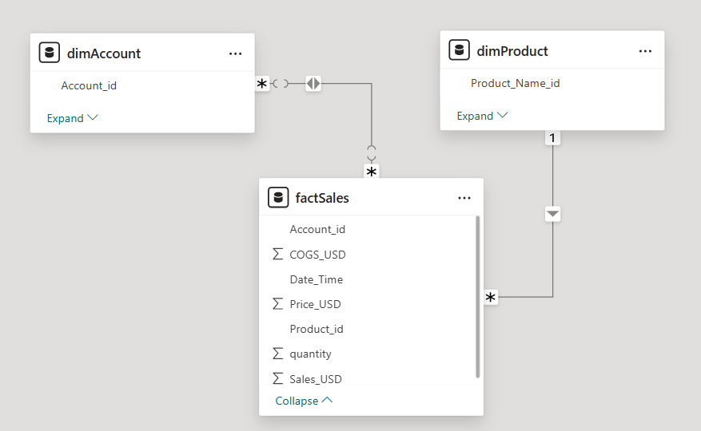
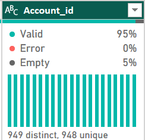
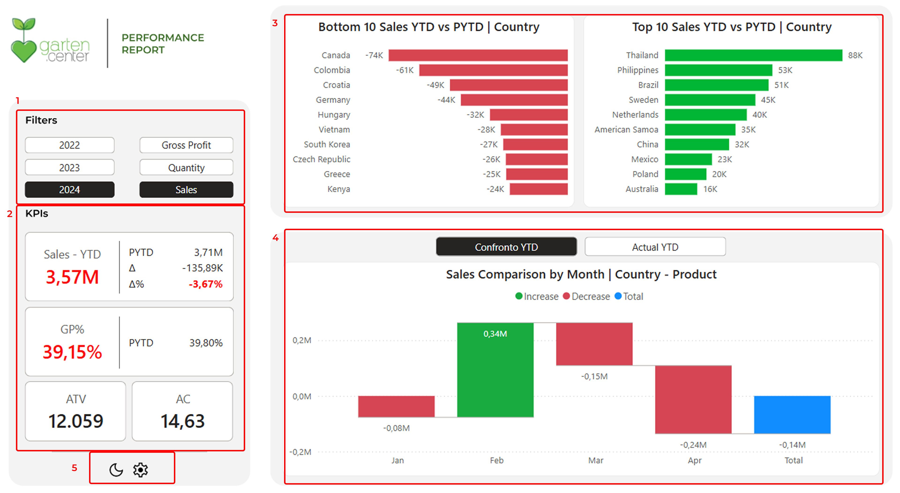
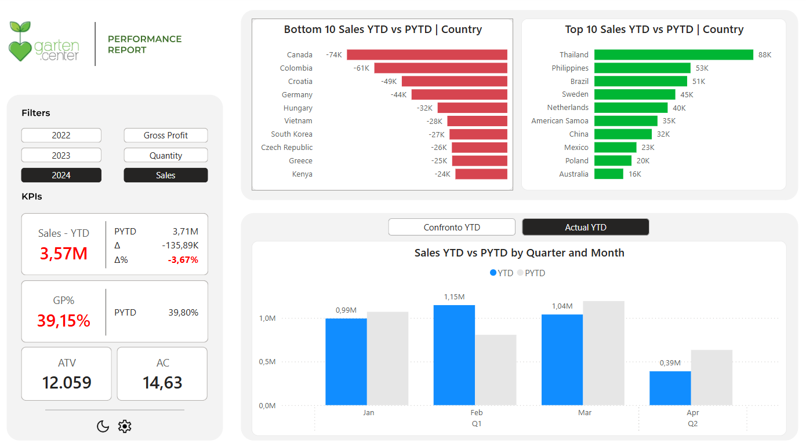
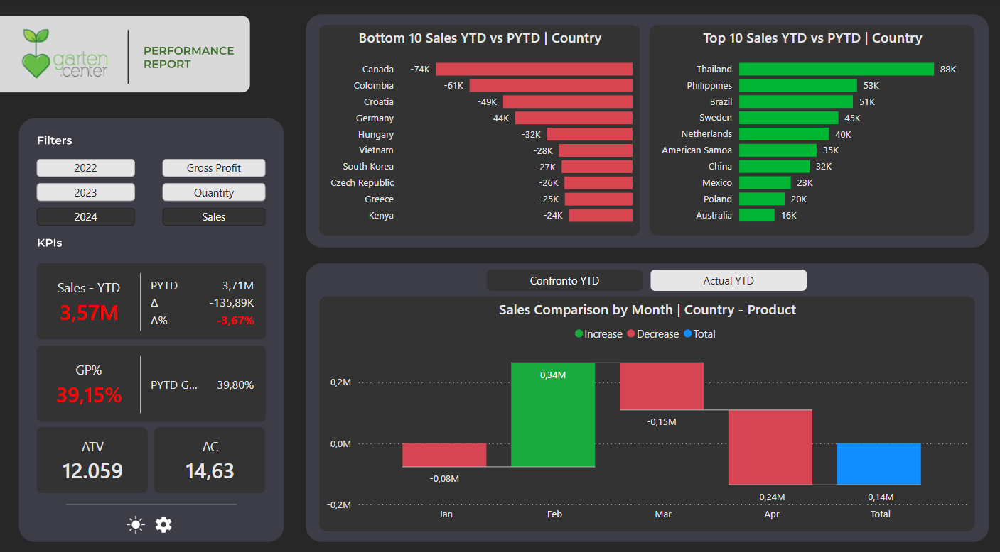
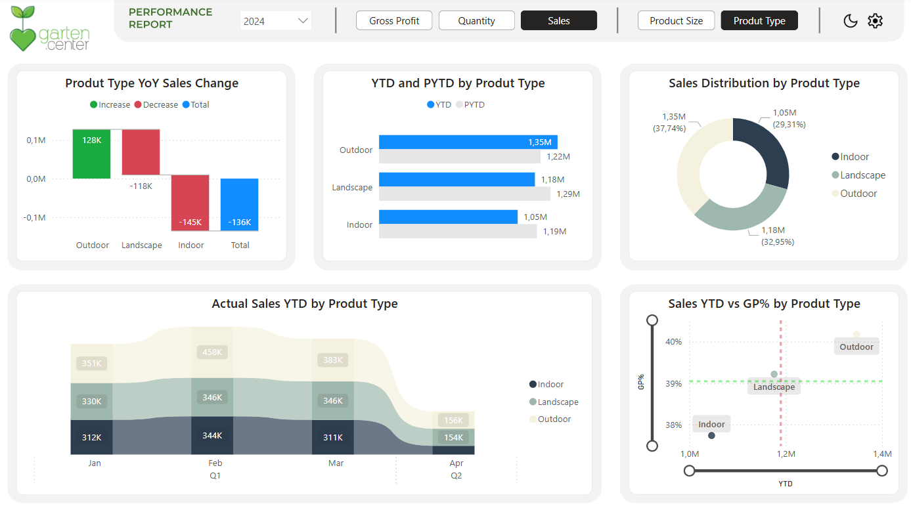
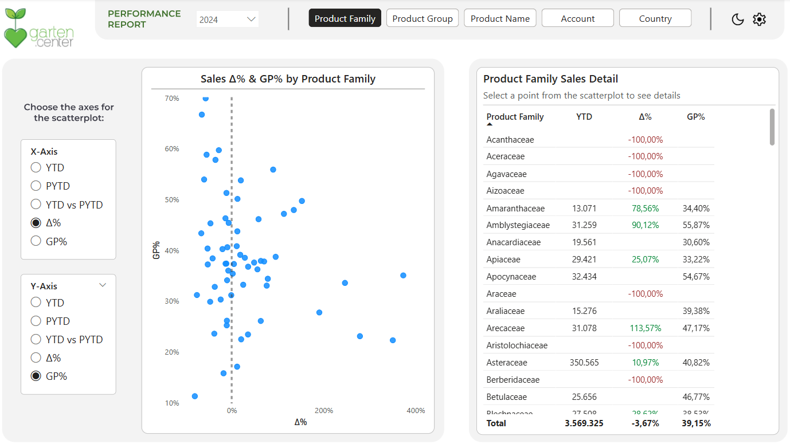
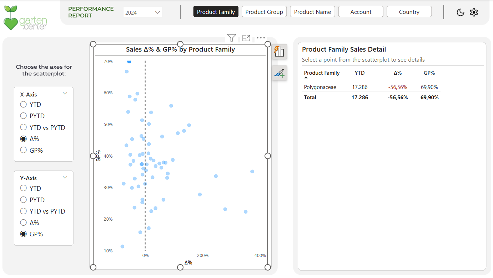
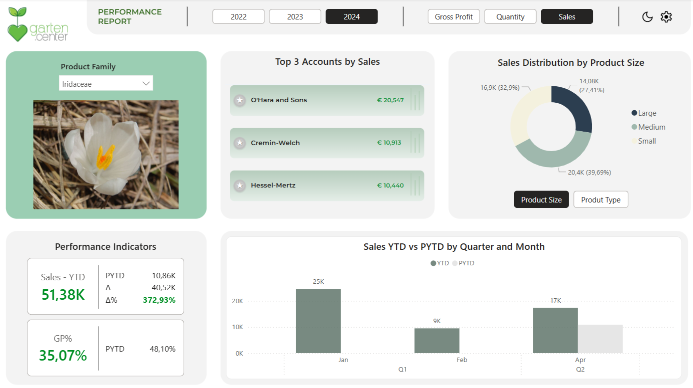

# Plant Shop: Report di Analisi delle Vendite

**Creato:** 25 giugno 2025 15:40  
**Tags:** Progetti, Power BI, Business Intelligence

## Introduzione al Progetto

Questo documento descrive il processo di costruzione di un report di analisi delle vendite per il progetto Plant Shop utilizzando Power BI. L'obiettivo è creare un dashboard interattivo che permetta di monitorare le performance commerciali e identificare opportunità di crescita.

## Configurazione Iniziale

Il primo passo consiste nel collegare Power BI al file Excel che funge da database del progetto tramite il connettore Excel. Il dataset è composto da tre tabelle principali:

- **Tabella dei fatti (factSales):** contiene tutte le vendite dello shop
- **Tabella dimensionale Account (dimAccount):** include le informazioni sui clienti
- **Tabella dimensionale Prodotti (dimProduct):** contiene i dettagli delle piante vendute

Dopo aver importato i dati, procediamo con la trasformazione delle tabelle in Power Query per verificarne il contenuto e applicare eventuali operazioni di data cleaning.

---

## Analisi delle Strutture Dati

### Tabella dei Fatti: factSales

La tabella contiene le transazioni commerciali con i seguenti elementi chiave:
- Prezzo di vendita
- Costo del prodotto
- Product_ID e Account_ID (foreign key per le connessioni)

### Tabella Dimensionale: dimAccount

Include informazioni geografiche dettagliate sui clienti:
- Paese (Country)
- Codice postale (Postal Code)
- Altri dati anagrafici

### Tabella Dimensionale: dimProduct

Contiene le informazioni sui prodotti venduti con una struttura gerarchica:
- Product_family (livello più alto)
- Product_group (livello intermedio)
- Product_name (livello di dettaglio)
- Classificazione per dimensioni e tipologia

---

## Risoluzione dei Problemi di Relazione



*Figura: Problema iniziale di relazione molti-a-molti tra dimAccount e factSales*

Durante la creazione del modello dati, ho identificato un problema nella relazione tra dimAccount e factSales: si era creata una relazione molti-a-molti anziché uno-a-molti. L'analisi ha rivelato che la chiave primaria Account_id di dimAccount conteneva valori nulli.


*Figura: Identificazione dei valori nulli nella colonna Account_id*

**Soluzione:** Rimozione dei valori nulli dalla colonna Account_id, ripristinando la corretta relazione uno-a-molti.

---

## Definizione dei KPI

Basandosi sui dati disponibili, ho progettato un set di indicatori chiave di performance (KPI) per monitorare le vendite:

### 1. Sales (Vendite Totali)
```dax
Sales = SUM(Fact_Sales[Sales_USD])
```

### 2. Quantity (Quantità Vendute)
```dax
Quantity = SUM(Fact_Sales[quantity])
```

### 3. COGS (Costo del Venduto)
```dax
COGs = SUM(Fact_Sales[COGS_USD])
```

### 4. Gross Profit (Profitto Lordo)
```dax
Gross Profit = [Sales] - [COGs]
```

### 5. Gross Profit% (Margine di Profitto)
```dax
GP% = DIVIDE([Gross Profit], [Sales])
```

---

## Struttura del Report

### Pagina 1: Dashboard Principale (Home)


*Figura 1: Dashboard principale del Plant Shop con layout a 5 sezioni*

La pagina principale offre una visione d'insieme delle performance attraverso un design intuitivo e funzionale:

**Sezioni principali:**

1. **Filtri Interattivi:** Selezione dell'anno e del KPI da visualizzare nelle dashboard

2. **Pannello KPI:** Visualizzazione dei principali indicatori con:
   - Valori correnti
   - Confronto con l'anno precedente (PYTD)
   - Scostamento assoluto (∆) e percentuale (∆%)

3. **Analisi Geografica:** Ranking dei paesi con migliori e peggiori performance in termini di scostamento annuale

4. **Grafico Waterfall:** Visualizzazione mensile delle performance con switch per alternare tra:
   - Confronto year-over-year
   - Andamento del periodo corrente
   
   
   *Figura 2: Switch per alternare tra vista comparativa e andamento corrente*

5. **Controlli Utente:** Opzione per attivare la modalità Dark Mode

   
   *Figura 3: Interfaccia in modalità scura per migliorare l'esperienza utente*

**Insight esempio:** Nel 2024, le vendite totali sono diminuite del 3,67% rispetto al 2023, con il Canada come peggior performer (-74k) e la Thailandia come migliore (+88k).

### Pagina 2: Analisi Prodotti per Tipologia/Dimensione


*Figura 4: Vista dell'analisi per tipologia prodotto - focus su categoria Outdoor*

Questa pagina esplora le performance per categoria di prodotto:

- **Switch dinamico** per alternare tra analisi per Type e Size
- **Visualizzazioni comparative** per identificare categorie in crescita
- **Scatterplot** per analizzare la correlazione tra volumi e redditività

**Insight di esempio:** I prodotti outdoor mostrano crescita year-over-year e rappresentano il segmento trainante delle vendite, con margini superiori rispetto alle categorie indoor e landscape.

### Pagina 3: Sales Analyzer


*Figura 6: Scatterplot personalizzabile per analisi multidimensionale*

Pagina di analisi avanzata con scatterplot personalizzabile:

- **Selezione flessibile** delle entità da analizzare (Product Family, Group, Name, Account, Country)
- **Assi configurabili** per esplorazioni multidimensionali
- **Tabella dinamica** che si filtra in base alle selezioni


*Figura 7: Esempio di drill-down sulla famiglia Polygonaceae*

**Caso d'uso esempio:** Identificazione della famiglia Polygonaceae, che pur avendo subito un calo del 50% nelle vendite, mantiene una redditività superiore al 70%, suggerendo opportunità di recovery.

### Pagina 4: Dettaglio Product Family


*Figura 8: Pagina dettaglio con immagini Wikipedia e visual SVG personalizzate*

Pagina dedicata all'analisi approfondita di singole famiglie di prodotti:

- **Immagini rappresentative** per ogni famiglia (ottenute tramite script Python che recupera automaticamente le immagini da Wikipedia)
- **Visual personalizzata "Top 3 Accounts"** realizzata con SVG in DAX per un design accattivante

**Implementazione tecnica:** La visual Top 3 utilizza codice SVG embedded in una misura DAX per creare card graficamente avanzate:

```dax
Top Account SVG per YTD = 
VAR _Account = MAX(Dim_Account[Account])
VAR _YTD = FORMAT([YTD], "€ #,##0")
VAR _TextColor = "#222222"
VAR _KPIColor = "#1A9641"
VAR _IconColor = "#C0C0C0"
VAR _ShadowColor = "rgba(0,0,0,0.15)"

VAR _SVG =
    "data:image/svg+xml;utf8," &
    "<svg width='700' height='110' xmlns='http://www.w3.org/2000/svg'>" &
    "<defs>" &
        "<linearGradient id='grad1' x1='0' y1='0' x2='0' y2='1'>" &
            "<stop offset='0%' stop-color='#b6cdbd'/>" &
            "<stop offset='100%' stop-color='#e4ede7'/>" &
        "</linearGradient>" &
    "</defs>" &
    "<rect width='700' height='110' fill='url(#grad1)' rx='15' ry='15'/>" &
    "<rect x='680' y='20' width='5' height='70' fill='#A6C8AA' opacity='0.4'/>" &
    "<rect x='665' y='35' width='5' height='55' fill='#A6C8AA' opacity='0.5'/>" &
    "<rect x='650' y='10' width='5' height='80' fill='#A6C8AA' opacity='0.3'/>" &
    "<circle cx='35' cy='55' r='22' fill='" & _IconColor & "' filter='url(#shadow)' />" &
    "<circle cx='35' cy='55' r='16' fill='white' opacity='0.15' />" &
    "<text x='35' y='55' font-size='24' font-weight='bold' fill='white' " &
        "text-anchor='middle' dominant-baseline='middle' " &
        "style='text-shadow: 1px 1px 2px rgba(0,0,0,0.3);'>★</text>" &
    "<text x='75' y='55' font-family='Montserrat' font-size='24' font-weight='500' fill='" & _TextColor & "' " &
        "dominant-baseline='middle'>" & _Account & "</text>" &
    "<text x='530' y='55' font-family='Montserrat' font-size='22' fill='" & _KPIColor & "' font-weight='600' " &
        "dominant-baseline='middle'>" & _YTD & "</text>" &
    "</svg>"

RETURN _SVG
```

---

## Conclusioni

Il report Plant Shop rappresenta una soluzione completa per l'analisi delle performance commerciali, offrendo:

- **Monitoraggio KPI** in tempo reale con confronti storici
- **Analisi multidimensionale** per identificare trend e opportunità
- **Interattività avanzata** per esplorazioni personalizzate
- **Design professionale** con elementi grafici personalizzati

Le funzionalità implementate permettono al management di prendere decisioni data-driven basate su insight precisi e visualizzazioni intuitive.
